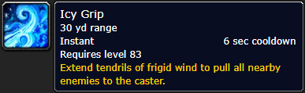
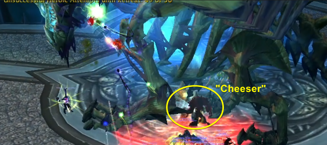
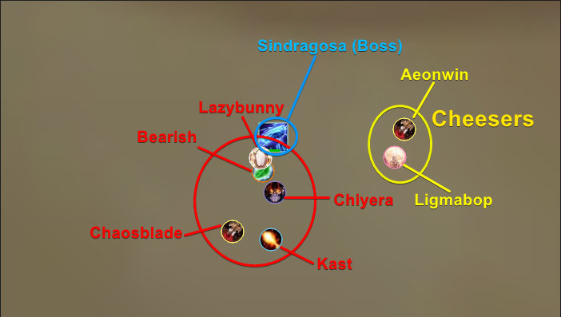
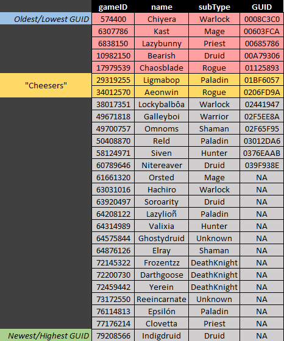
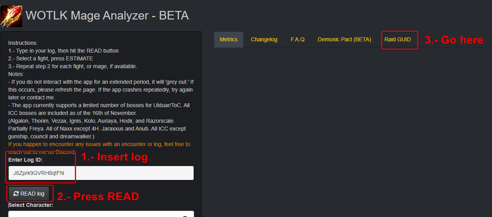
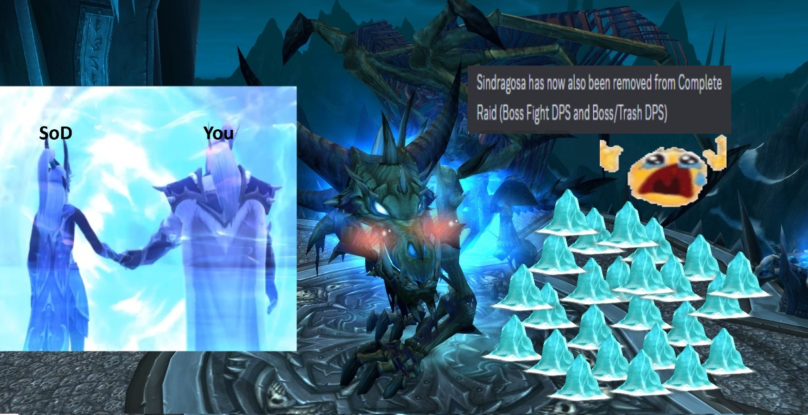

# 🧀Sindragosa Cheese🧀 - GUID 101<br/>

_Vivax (Pagle-US) -_ `Discfordge` _(Discord)_

The following document details how to maximize and optimize the "cheese" to avoid getting pulled by the ability "Icy Grip" during the encounter with "Sindragosa", final boss of the Frostwing Hall at the Icecrown Citadel (ICC).

You can guarantee that **nobody** will get pulled into her hitbox by knowing the GUIDs of your raid. 

This was written for the Classic version of World of Warcraft: Wrath of the Lich King (as of February 2024).

 <br />

## **SUMMARY**
### **Tl;dr**

**YOU WANT THE OLDEST CHARACTER IN YOUR RAID (LOWEST GUID) TO DO THE "CHEESE".**

**CASTER/RANGED ARE ALSO ABLE TO DO THE "CHEESE"**

**YOU CAN CHECK THE GUIDs OF YOUR RAID YOURSELF AT https://wotlk-mage.herokuapp.com/**

-	30s into the fight and every 30s after each air phase, Sindragosa casts Icy Grip, which pulls (read: sucks) your raid into the boss hitbox. 

-	Whenever someone stands in the center of Sindragosa hitbox, _**most**_ of the raid will completely ignore the Icy Grip (this is the “cheese”). However, sometimes some people get pulled despite the “cheese”.

-	Who gets pulled or not into Sindragosa while doing the “cheese” is based on the GUID of the character standing inside her hitbox (“the cheeser”). To avoid _**everyone**_ from getting sucked into her hitbox, the person with the lowest/oldest GUID should be the one standing in the middle. Only those with a lower/older GUID relative to the “cheeser” will be sucked into, and those with a higher/newer GUID won’t.


## **Background**

Ignoring Icy Grip has been known since 2010, when the raid and the encounter were first released, as seen in a [YouTube video explaining how to do the "cheese"](https://www.youtube.com/watch?v=CqIjp4BNY8c&t=37s) and its respective [forum post](https://www.ownedcore.com/forums/world-of-warcraft/world-of-warcraft-exploits/297916-how-avoid-icy-grip-before-blistering-cold-sindragosa.html).

The “cheese” to ignore this mechanic entirely relies on a melee DPS ([or caster/ranged, that also works](https://classic.warcraftlogs.com/reports/Zp1rJWLjkmn4byw7#fight=34&view=replay)) standing on the center of Sindragosa hitbox. 
This causes Icy Grip to not pull/suck your raid into her hitbox. 

 <br />

This by itself doesn’t guarantee _**everyone**_ in your raid from ignoring the mechanic, and these “exceptions” are related to the GUID of the characters in your raid.

In short, if the lowest/oldest character in your raid stands under Sindragosa, nobody gets gripped.

## **Illustrated example (for kids)**

> The following example is based on the following log:<br />
> https://classic.warcraftlogs.com/reports/ftk82FZgKnvW7rYd#fight=36

When not “cheesing” Icy Grip, your entire raid gets pulled into Sindragosa.

This leads to lower uptime (and lower DPS) across the entire raid.


In contrast, this is how it looks like when the mechanic is properly "cheesed". 
Only a few people get pulled into Sindragosa hitbox.


There is one thing to highlight here: 

There were five (5) players getting pulled/dragged into Sindragosa hitbox. 

This example has two (2) “cheesers” (however, you can do this with one (1) cheeser and it will work just fine).

 <br />

The five (5) players still getting gripped into Sindragosa hitbox are getting gripped despite the cheese because their GUIDs (or gameIDs) are lower/older than those of the players doing the “cheese”.

As can be seen in the following table.

 <br />

To the best of my knowledge, you can retrieve the GUIDs of your guild with the following command (in-game chat): 
```
/run g1={GetNumGuildMembers()};g2=tonumber(g1[1]);i=1 repeat local info={GetGuildRosterInfo(i)};if info[17]< UnitGUID("player")then print(info[1])print(info[17])end i=i+1 until i>g2
```
This will print the GUID of guildies with an older/lower GUID than yours in your chat window.

You can then copy this information into an excel by using the add-on Prat (Select chat as text -> Ctrl + A -> Ctrl + C)

Alternatively, you can look up the gameID of the characters in your log with the [“Mage Analyzer” app](https://wotlk-mage.herokuapp.com/),

 <br />

The app extracts the gameID from logs uploaded to [Woodchopper website](https://classic.warcraftlogs.com/). You can extract these yourself through their API if [you know what you are doing.](https://www.warcraftlogs.com/api/docs)

## Additional information

The "cheese" is commonly done by melee DPS, either by one (1) melee DPS or by making the entirety of your melee DPS wiggle/stack on Sindragosa.

However, ranged/caster characters can also successfully "cheese" Icy Grip. All it needs to do is position itself inside Sindy hitbox.

## Acknowledgments 

Thanks whispar `[whispar]` and Reprieve `[r3pr13v3]` at Fight Club for convincing me that Sindragosa cheese was in fact influenced by GUID. 

Louki `[l0uki]` for the comments and insights.

Shekza `[dead_if_read]` at Classic Hunter Lodge for the in-game GUID code and Teucer `[justevan]` for making me question what we knew about the cheese and indirectly making me write this document.

## Banner

 <br />

## Other analysis and random stuff

- If you have questions, you can contact me on discord: https://discord.gg/wp55kqmyYG (Discord: Discfordge) <br />

- Consider buying me a coffee? :) https://ko-fi.com/forge

- Or check other things I have done here: https://github.com/ForgeGit?tab=repositories
